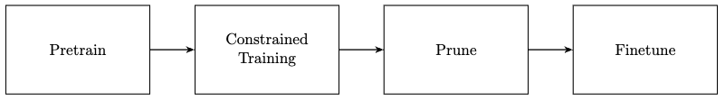

# Yolov8 Pruning
This repository is the original source. For a more detailed repository and accompanying video explanations【Chinese: shouxie_ai’s paid video tutorial, contact wechat: shouxie_ai; English: comming】


- [1. Pretrain[optional]](#1-pretrainoptional)
- [2. Constrained Training](#2-constrained-training)
- [3. Prune](#3-prune)
- [4. Finetune](#4-finetune)

<br>
<br>
<br>


- Takeaway: 
Experiments using the yolov8s model on VOC2007 showed pretraining and constrained training reaching a similar mAP50(B) of ~0.77 at epoch 50. After pruning, the finetuning phase took 65 epochs to achieve the same mAP50(B). The ONNX model size reduced from 43M to 36M after pruning.
<br>
<br>
<br>


## 1. Pretrain[optional]

- git clone
- use VOC2007, and modify the VOC.yaml
- disable amp
```python
# FILE: ultralytics/yolo/engine/trainer.py
...
def check_amp(model):
    # Avoid using mixed precision to affect finetune
    return False # <============== modified
    device = next(model.parameters()).device  # get model device
    if device.type in ('cpu', 'mps'):
        return False  # AMP only used on CUDA devices

    def amp_allclose(m, im):
        # All close FP32 vs AMP results
    ...

```

<details>
  <summary><strong>Training log</strong></summary>

| epoch | train/box_loss | train/cls_loss | train/dfl_loss | metrics/precision(B) | metrics/recall(B) | metrics/mAP50(B) | metrics/mAP50-95(B) | val/box_loss | val/cls_loss | val/dfl_loss | lr/pg0    | lr/pg1    | lr/pg2    |
|-------|----------------|----------------|----------------|----------------------|-------------------|------------------|---------------------|--------------|--------------|--------------|-----------|-----------|-----------|
| 0     | 0.92673        | 1.6385         | 1.2113         | 0.77207              | 0.77506           | 0.83161          | 0.63104             | 0.84319      | 0.8203       | 1.1008       | 0.070096  | 0.0033227 | 0.0033227 |
| 1     | 0.9417         | 1.1234         | 1.2114         | 0.67739              | 0.61248           | 0.66058          | 0.45227             | 1.0539       | 1.1543       | 1.2772       | 0.04003   | 0.0065902 | 0.0065902 |
| 2     | 1.0578         | 1.2969         | 1.296          | 0.58292              | 0.47764           | 0.50248          | 0.30112             | 1.2869       | 1.6265       | 1.4896       | 0.0098978 | 0.0097916 | 0.0097916 |
| 3     | 1.1906         | 1.5575         | 1.3958         | 0.54442              | 0.48757           | 0.48652          | 0.29632             | 1.3197       | 1.5872       | 1.5178       | 0.009703  | 0.009703  | 0.009703  |
| 4     | 1.204          | 1.5625         | 1.4142         | 0.57654              | 0.49493           | 0.51143          | 0.31174             | 1.2786       | 1.5057       | 1.4828       | 0.009703  | 0.009703  | 0.009703  |
| 5     | 1.1945         | 1.5082         | 1.4009         | 0.61871              | 0.52062           | 0.5703           | 0.35654             | 1.265        | 1.4636       | 1.4805       | 0.009604  | 0.009604  | 0.009604  |
| 6     | 1.1744         | 1.4468         | 1.3858         | 0.62485              | 0.57612           | 0.60489          | 0.3855              | 1.2203       | 1.3206       | 1.4285       | 0.009505  | 0.009505  | 0.009505  |
| 7     | 1.1517         | 1.4118         | 1.375          | 0.61661              | 0.59905           | 0.61871          | 0.39268             | 1.2074       | 1.3148       | 1.4195       | 0.009406  | 0.009406  | 0.009406  |
| 8     | 1.1299         | 1.3454         | 1.3518         | 0.66592              | 0.58576           | 0.62926          | 0.40537             | 1.1967       | 1.2811       | 1.4135       | 0.009307  | 0.009307  | 0.009307  |
| 9     | 1.1133         | 1.3284         | 1.348          | 0.67145              | 0.59822           | 0.64811          | 0.42689             | 1.1539       | 1.2208       | 1.3799       | 0.009208  | 0.009208  | 0.009208  |
| 10    | 1.1031         | 1.2827         | 1.3376         | 0.65911              | 0.61371           | 0.65124          | 0.42923             | 1.1579       | 1.2286       | 1.3815       | 0.009109  | 0.009109  | 0.009109  |
| 11    | 1.0827         | 1.2543         | 1.3268         | 0.71019              | 0.61398           | 0.68202          | 0.45785             | 1.1323       | 1.1531       | 1.3561       | 0.00901   | 0.00901   | 0.00901   |
| 12    | 1.0642         | 1.242          | 1.315          | 0.70052              | 0.61976           | 0.67969          | 0.45524             | 1.1335       | 1.154        | 1.3547       | 0.008911  | 0.008911  | 0.008911  |
| 13    | 1.0623         | 1.1975         | 1.3067         | 0.70224              | 0.6279            | 0.68803          | 0.46259             | 1.1211       | 1.1146       | 1.3568       | 0.008812  | 0.008812  | 0.008812  |
| 14    | 1.0489         | 1.1583         | 1.2964         | 0.71233              | 0.64626           | 0.70062          | 0.47288             | 1.1182       | 1.1015       | 1.3457       | 0.008713  | 0.008713  | 0.008713  |
| 15    | 1.0374         | 1.1518         | 1.2905         | 0.70464              | 0.63515           | 0.69193          | 0.46424             | 1.1156       | 1.0929       | 1.3454       | 0.008614  | 0.008614  | 0.008614  |
| 16    | 1.014          | 1.1291         | 1.2738         | 0.67909              | 0.64529           | 0.6864           | 0.46629             | 1.117        | 1.1117       | 1.3469       | 0.008515  | 0.008515  | 0.008515  |
| 17    | 1.0183         | 1.1054         | 1.2703         | 0.73264              | 0.64282           | 0.71155          | 0.48454             | 1.0994       | 1.0573       | 1.3332       | 0.008416  | 0.008416  | 0.008416  |
| 18    | 0.99619        | 1.0777         | 1.2573         | 0.72897              | 0.65939           | 0.71447          | 0.49011             | 1.0935       | 1.0545       | 1.3281       | 0.008317  | 0.008317  | 0.008317  |
| 19    | 0.98963        | 1.0468         | 1.2505         | 0.72029              | 0.66052           | 0.71277          | 0.49032             | 1.0875       | 1.0753       | 1.3206       | 0.008218  | 0.008218  | 0.008218  |
| 20    | 0.97962        | 1.0346         | 1.247          | 0.73563              | 0.6511            | 0.7142           | 0.49308             | 1.0702       | 1.0447       | 1.3112       | 0.008119  | 0.008119  | 0.008119  |
| 21    | 0.97159        | 1.0108         | 1.2417         | 0.72999              | 0.65638           | 0.71672          | 0.49605             | 1.073        | 1.0317       | 1.3106       | 0.00802   | 0.00802   | 0.00802   |
| 22    | 0.96612        | 0.99422        | 1.2354         | 0.73903              | 0.65636           | 0.71879          | 0.4968              | 1.0853       | 1.0214       | 1.3102       | 0.007921  | 0.007921  | 0.007921  |
| 23    | 0.95418        | 0.97995        | 1.2299         | 0.74019              | 0.6648            | 0.73817          | 0.51044             | 1.0775       | 1.0068       | 1.3188       | 0.007822  | 0.007822  | 0.007822  |
| 24    | 0.94679        | 0.96945        | 1.2227         | 0.73285              | 0.67695           | 0.72656          | 0.50312             | 1.0554       | 0.98838      | 1.2957       | 0.007723  | 0.007723  | 0.007723  |
| 25    | 0.93552        | 0.95821        | 1.217          | 0.74328              | 0.67199           | 0.72949          | 0.50698             | 1.0687       | 1.0016       | 1.3023       | 0.007624  | 0.007624  | 0.007624  |
| 26    | 0.93168        | 0.94349        | 1.2141         | 0.76862              | 0.66199           | 0.74154          | 0.5189              | 1.0617       | 0.98225      | 1.3112       | 0.007525  | 0.007525  | 0.007525  |
| 27    | 0.92401        | 0.93271        | 1.2139         | 0.7524               | 0.66939           | 0.73902          | 0.52226             | 1.0512       | 0.98525      | 1.297        | 0.007426  | 0.007426  | 0.007426  |
| 28    | 0.9235         | 0.90858        | 1.2047         | 0.74359              | 0.68755           | 0.73913          | 0.5187              | 1.0651       | 0.97496      | 1.3055       | 0.007327  | 0.007327  | 0.007327  |
| 29    | 0.91447        | 0.90524        | 1.2013         | 0.7685               | 0.6854            | 0.75282          | 0.53004             | 1.0501       | 0.94474      | 1.2915       | 0.007228  | 0.007228  | 0.007228  |
| 30    | 0.90837        | 0.88461        | 1.1886         | 0.74858              | 0.69356           | 0.74533          | 0.51988             | 1.0576       | 0.95429      | 1.2979       | 0.007129  | 0.007129  | 0.007129  |
| 31    | 0.89539        | 0.8767         | 1.1835         | 0.76213              | 0.67857           | 0.74776          | 0.52786             | 1.0522       | 0.95761      | 1.2928       | 0.00703   | 0.00703   | 0.00703   |
| 32    | 0.88759        | 0.8647         | 1.179          | 0.77072              | 0.68623           | 0.75324          | 0.53284             | 1.0454       | 0.95159      | 1.2888       | 0.006931  | 0.006931  | 0.006931  |
| 33    | 0.88108        | 0.85207        | 1.1745         | 0.76965              | 0.69816           | 0.76108          | 0.5428              | 1.0429       | 0.94663      | 1.2876       | 0.006832  | 0.006832  | 0.006832  |
| 34    | 0.88291        | 0.84293        | 1.1768         | 0.75702              | 0.70109           | 0.75217          | 0.53493             | 1.0437       | 0.92887      | 1.2811       | 0.006733  | 0.006733  | 0.006733  |
| 35    | 0.86054        | 0.83013        | 1.1648         | 0.77788              | 0.68466           | 0.75603          | 0.53917             | 1.0429       | 0.94194      | 1.2908       | 0.006634  | 0.006634  | 0.006634  |
| 36    | 0.85863        | 0.81798        | 1.1658         | 0.7657               | 0.69179           | 0.7546           | 0.53687             | 1.0328       | 0.93694      | 1.2801       | 0.006535  | 0.006535  | 0.006535  |
| 37    | 0.86479        | 0.80596        | 1.159          | 0.775                | 0.69038           | 0.7588           | 0.54172             | 1.0295       | 0.9394       | 1.2787       | 0.006436  | 0.006436  | 0.006436  |
| 38    | 0.84868        | 0.79285        | 1.1563         | 0.77168              | 0.69569           | 0.76378          | 0.54661             | 1.0268       | 0.90889      | 1.278        | 0.006337  | 0.006337  | 0.006337  |
| 40    | 0.83386        | 0.77434        | 1.1441         | 0.78373              | 0.68312           | 0.75814          | 0.54293             | 1.0315       | 0.91365      | 1.2843       | 0.006139  | 0.006139  | 0.006139  |
| 41    | 0.83605        | 0.76247        | 1.1441         | 0.76758              | 0.70613           | 0.76328          | 0.5461              | 1.0404       | 0.90907      | 1.286        | 0.00604   | 0.00604   | 0.00604   |
| 42    | 0.82537        | 0.75351        | 1.1383         | 0.77132              | 0.69906           | 0.75637          | 0.54226             | 1.0325       | 0.91358      | 1.2826       | 0.005941  | 0.005941  | 0.005941  |
| 43    | 0.82065        | 0.7466         | 1.1337         | 0.78819              | 0.69624           | 0.76861          | 0.5532              | 1.0267       | 0.90715      | 1.2777       | 0.005842  | 0.005842  | 0.005842  |
| 44    | 0.81619        | 0.74658        | 1.1335         | 0.76049              | 0.7084            | 0.76285          | 0.54782             | 1.0149       | 0.91284      | 1.2674       | 0.005743  | 0.005743  | 0.005743  |
| 45    | 0.80921        | 0.73341        | 1.1287         | 0.7871               | 0.70758           | 0.77009          | 0.55715             | 1.0166       | 0.89331      | 1.2704       | 0.005644  | 0.005644  | 0.005644  |
| 46    | 0.80473        | 0.73055        | 1.1264         | 0.78967              | 0.7021            | 0.77082          | 0.55884             | 1.0233       | 0.9001       | 1.2791       | 0.005545  | 0.005545  | 0.005545  |
| 47    | 0.79876        | 0.7237         | 1.1205         | 0.78231              | 0.71046           | 0.77262          | 0.55573             | 1.0241       | 0.88496      | 1.2789       | 0.005446  | 0.005446  | 0.005446  |
| 48    | 0.79629        | 0.7041         | 1.118          | 0.79295              | 0.69772           | 0.77068          | 0.55465             | 1.0314       | 0.88591      | 1.2802       | 0.005347  | 0.005347  | 0.005347  |
| 49    | 0.78996        | 0.70273        | 1.1133         | 0.79776              | 0.70282           | 0.77587          | 0.56048             | 1.0228       | 0.87524      | 1.2721       | 0.005248  | 0.005248  | 0.005248  |
| 50    | 0.78926        | 0.70901        | 1.1161         | 0.80225              | 0.69859           | 0.773            | 0.56149             | 1.0208       | 0.89449      | 1.2797       | 0.005149  | 0.005149  | 0.005149  |
</details>

<br>
<br>
<br>

## 2. Constrained Training
- prune the BN layer by adding L1 regularizer.

```python
# FILE: ultralytics/yolo/engine/trainer.py
...
# Backward
self.scaler.scale(self.loss).backward()

# <============ added
l1_lambda = 1e-2 * (1 - 0.9 * epoch / self.epochs)
for k, m in self.model.named_modules():
    if isinstance(m, nn.BatchNorm2d):
        m.weight.grad.data.add_(l1_lambda * torch.sign(m.weight.data))
        m.bias.grad.data.add_(1e-2 * torch.sign(m.bias.data))

# Optimize - https://pytorch.org/docs/master/notes/amp_examples.html
if ni - last_opt_step >= self.accumulate:
    self.optimizer_step()
    last_opt_step = ni
...
```
<details>
  <summary><strong>Training log</strong></summary>

| epoch | train/box_loss | train/cls_loss | train/dfl_loss | metrics/precision(B) | metrics/recall(B) | metrics/mAP50(B) | metrics/mAP50-95(B) | val/box_loss | val/cls_loss | val/dfl_loss | lr/pg0    | lr/pg1    | lr/pg2    |
|-------|----------------|----------------|----------------|----------------------|-------------------|------------------|---------------------|--------------|--------------|--------------|-----------|-----------|-----------|
| 0     | 0.92565        | 1.6423         | 1.2109         | 0.78443              | 0.76733           | 0.82516          | 0.62045             | 0.86821      | 0.84614      | 1.1113       | 0.070096  | 0.0033227 | 0.0033227 |
| 1     | 0.94448        | 1.1347         | 1.2122         | 0.73125              | 0.67825           | 0.73839          | 0.52702             | 0.96679      | 1.0091       | 1.2034       | 0.04003   | 0.0065902 | 0.0065902 |
| 2     | 1.0604         | 1.3009         | 1.2986         | 0.6136               | 0.54731           | 0.57973          | 0.37943             | 1.1684       | 1.4044       | 1.3756       | 0.0098978 | 0.0097916 | 0.0097916 |
| 3     | 1.196          | 1.5631         | 1.3974         | 0.58267              | 0.48531           | 0.51603          | 0.31687             | 1.2998       | 1.5516       | 1.5155       | 0.009703  | 0.009703  | 0.009703  |
| 4     | 1.2029         | 1.5454         | 1.4114         | 0.6036               | 0.5207            | 0.55252          | 0.34034             | 1.2789       | 1.4587       | 1.4855       | 0.009703  | 0.009703  | 0.009703  |
| 5     | 1.202          | 1.5032         | 1.4049         | 0.5087               | 0.40369           | 0.40513          | 0.23736             | 1.4244       | 1.8939       | 1.6476       | 0.009604  | 0.009604  | 0.009604  |
| 6     | 1.1764         | 1.4465         | 1.3887         | 0.63867              | 0.55878           | 0.60577          | 0.38883             | 1.2146       | 1.2978       | 1.4348       | 0.009505  | 0.009505  | 0.009505  |
| 7     | 1.1522         | 1.3962         | 1.3754         | 0.656                | 0.5712            | 0.62207          | 0.40084             | 1.237        | 1.3347       | 1.4478       | 0.009406  | 0.009406  | 0.009406  |
| 8     | 1.127          | 1.3373         | 1.354          | 0.67759              | 0.58              | 0.63802          | 0.41447             | 1.1818       | 1.2604       | 1.3894       | 0.009307  | 0.009307  | 0.009307  |
| 9     | 1.1105         | 1.3162         | 1.3473         | 0.64599              | 0.56469           | 0.61175          | 0.39579             | 1.1895       | 1.2821       | 1.4132       | 0.009208  | 0.009208  | 0.009208  |
| 10    | 1.1008         | 1.2829         | 1.3399         | 0.69645              | 0.61177           | 0.66806          | 0.44422             | 1.1531       | 1.1822       | 1.3768       | 0.009109  | 0.009109  | 0.009109  |
| 11    | 1.0765         | 1.2522         | 1.3232         | 0.71631              | 0.60926           | 0.68153          | 0.4529              | 1.1446       | 1.136        | 1.3674       | 0.00901   | 0.00901   | 0.00901   |
| 12    | 1.0662         | 1.2235         | 1.3134         | 0.69318              | 0.62751           | 0.67452          | 0.45073             | 1.132        | 1.1636       | 1.3594       | 0.008911  | 0.008911  | 0.008911  |
| 13    | 1.0616         | 1.1851         | 1.2999         | 0.71751              | 0.61549           | 0.68857          | 0.46305             | 1.1255       | 1.1331       | 1.347        | 0.008812  | 0.008812  | 0.008812  |
| 14    | 1.0494         | 1.1522         | 1.2947         | 0.69513              | 0.63001           | 0.67925          | 0.45575             | 1.12         | 1.1272       | 1.3465       | 0.008713  | 0.008713  | 0.008713  |
| 15    | 1.037          | 1.1478         | 1.2873         | 0.70825              | 0.63711           | 0.68977          | 0.46421             | 1.1219       | 1.097        | 1.3403       | 0.008614  | 0.008614  | 0.008614  |
| 16    | 1.0175         | 1.1304         | 1.2747         | 0.73014              | 0.6315            | 0.70322          | 0.47744             | 1.1077       | 1.077        | 1.3344       | 0.008515  | 0.008515  | 0.008515  |
| 17    | 1.0172         | 1.0993         | 1.269          | 0.74106              | 0.65394           | 0.72733          | 0.49715             | 1.0884       | 1.0431       | 1.3239       | 0.008416  | 0.008416  | 0.008416  |
| 18    | 1.0009         | 1.0633         | 1.2578         | 0.73366              | 0.6424            | 0.71016          | 0.4857              | 1.0928       | 1.0509       | 1.3175       | 0.008317  | 0.008317  | 0.008317  |
| 19    | 0.99458        | 1.0608         | 1.2552         | 0.73498              | 0.65621           | 0.72397          | 0.50389             | 1.0748       | 1.0456       | 1.3113       | 0.008218  | 0.008218  | 0.008218  |
| 20    | 0.97939        | 1.0313         | 1.2465         | 0.75441              | 0.64815           | 0.7261           | 0.50359             | 1.0737       | 1.0337       | 1.3059       | 0.008119  | 0.008119  | 0.008119  |
| 21    | 0.97806        | 1.026          | 1.2422         | 0.72394              | 0.63557           | 0.70287          | 0.48524             | 1.0717       | 1.0369       | 1.2972       | 0.00802   | 0.00802   | 0.00802   |
| 22    | 0.97879        | 1.0127         | 1.2431         | 0.7394               | 0.65045           | 0.71215          | 0.48902             | 1.0888       | 1.0292       | 1.3174       | 0.007921  | 0.007921  | 0.007921  |
| 23    | 0.95895        | 0.99651        | 1.232          | 0.73731              | 0.67343           | 0.73924          | 0.51158             | 1.0691       | 0.99626      | 1.3042       | 0.007822  | 0.007822  | 0.007822  |
| 24    | 0.95615        | 0.99158        | 1.2322         | 0.73624              | 0.66665           | 0.72512          | 0.50267             | 1.0644       | 1.0126       | 1.3008       | 0.007723  | 0.007723  | 0.007723  |
| 25    | 0.94517        | 0.97143        | 1.2231         | 0.75806              | 0.65886           | 0.73128          | 0.50956             | 1.0688       | 0.99726      | 1.3039       | 0.007624  | 0.007624  | 0.007624  |
| 26    | 0.93639        | 0.95727        | 1.2188         | 0.74016              | 0.67544           | 0.73665          | 0.5112              | 1.0563       | 0.98787      | 1.3013       | 0.007525  | 0.007525  | 0.007525  |
| 27    | 0.93284        | 0.94819        | 1.2209         | 0.73318              | 0.67589           | 0.73246          | 0.51282             | 1.0617       | 0.9874       | 1.2937       | 0.007426  | 0.007426  | 0.007426  |
| 28    | 0.9343         | 0.93543        | 1.2115         | 0.74821              | 0.68133           | 0.74574          | 0.52401             | 1.0533       | 0.97285      | 1.2896       | 0.007327  | 0.007327  | 0.007327  |
| 29    | 0.92951        | 0.93541        | 1.2125         | 0.75947              | 0.67266           | 0.74126          | 0.51764             | 1.054        | 0.96946      | 1.2953       | 0.007228  | 0.007228  | 0.007228  |
| 30    | 0.92688        | 0.91381        | 1.2025         | 0.74962              | 0.67131           | 0.73941          | 0.5137              | 1.0758       | 0.9762       | 1.3053       | 0.007129  | 0.007129  | 0.007129  |
| 31    | 0.91471        | 0.91552        | 1.1992         | 0.75604              | 0.67727           | 0.7467           | 0.52798             | 1.0448       | 0.96641      | 1.2824       | 0.00703   | 0.00703   | 0.00703   |
| 32    | 0.90619        | 0.89194        | 1.1904         | 0.74516              | 0.68767           | 0.75086          | 0.52798             | 1.0448       | 0.95155      | 1.2845       | 0.006931  | 0.006931  | 0.006931  |
| 33    | 0.9009         | 0.89107        | 1.1897         | 0.74989              | 0.67013           | 0.74297          | 0.52946             | 1.0401       | 0.96254      | 1.287        | 0.006832  | 0.006832  | 0.006832  |
| 34    | 0.903          | 0.88358        | 1.1913         | 0.75685              | 0.68489           | 0.74407          | 0.52314             | 1.053        | 0.95245      | 1.2863       | 0.006733  | 0.006733  | 0.006733  |
| 35    | 0.88498        | 0.87044        | 1.1804         | 0.76152              | 0.6916            | 0.75495          | 0.53359             | 1.046        | 0.94952      | 1.2841       | 0.006634  | 0.006634  | 0.006634  |
| 36    | 0.88366        | 0.86359        | 1.1834         | 0.75568              | 0.70024           | 0.75525          | 0.53069             | 1.0468       | 0.9341       | 1.2886       | 0.006535  | 0.006535  | 0.006535  |
| 37    | 0.88893        | 0.85432        | 1.1778         | 0.76405              | 0.68825           | 0.75449          | 0.53531             | 1.0425       | 0.94635      | 1.2855       | 0.006436  | 0.006436  | 0.006436  |
| 38    | 0.87813        | 0.85042        | 1.178          | 0.76257              | 0.67111           | 0.74801          | 0.52377             | 1.0624       | 0.9561       | 1.3098       | 0.006337  | 0.006337  | 0.006337  |
| 39    | 0.88227        | 0.84591        | 1.172          | 0.77845              | 0.69019           | 0.7627           | 0.53847             | 1.0465       | 0.92067      | 1.2847       | 0.006238  | 0.006238  | 0.006238  |
| 40    | 0.87228        | 0.82927        | 1.1709         | 0.77537              | 0.69448           | 0.76192          | 0.5392              | 1.0454       | 0.91643      | 1.2826       | 0.006139  | 0.006139  | 0.006139  |
| 41    | 0.86389        | 0.82287        | 1.1627         | 0.7626               | 0.7069            | 0.76237          | 0.54594             | 1.0379       | 0.91307      | 1.2755       | 0.00604   | 0.00604   | 0.00604   |
| 42    | 0.85961        | 0.81907        | 1.161          | 0.77033              | 0.70088           | 0.76257          | 0.54426             | 1.0371       | 0.90801      | 1.2758       | 0.005941  | 0.005941  | 0.005941  |
| 43    | 0.85414        | 0.80214        | 1.1564         | 0.76815              | 0.69915           | 0.76696          | 0.54287             | 1.0426       | 0.9051       | 1.281        | 0.005842  | 0.005842  | 0.005842  |
| 44    | 0.85261        | 0.81496        | 1.1614         | 0.77                 | 0.69292           | 0.76054          | 0.53674             | 1.0424       | 0.92179      | 1.277        | 0.005743  | 0.005743  | 0.005743  |
| 45    | 0.85068        | 0.8013         | 1.1564         | 0.78907              | 0.69016           | 0.77027          | 0.54926             | 1.0389       | 0.90745      | 1.2772       | 0.005644  | 0.005644  | 0.005644  |
| 46    | 0.84368        | 0.80178        | 1.1515         | 0.79301              | 0.69554           | 0.7723           | 0.55095             | 1.0459       | 0.90891      | 1.2887       | 0.005545  | 0.005545  | 0.005545  |
| 47    | 0.84028        | 0.79458        | 1.1483         | 0.76734              | 0.70468           | 0.76809          | 0.54484             | 1.044        | 0.89653      | 1.283        | 0.005446  | 0.005446  | 0.005446  |
| 48    | 0.83392        | 0.77818        | 1.1443         | 0.77305              | 0.69609           | 0.76721          | 0.54672             | 1.036        | 0.89301      | 1.2787       | 0.005347  | 0.005347  | 0.005347  |
| 49    | 0.83255        | 0.78041        | 1.1439         | 0.76445              | 0.71068           | 0.76725          | 0.54742             | 1.0361       | 0.89842      | 1.2748       | 0.005248  | 0.005248  | 0.005248  |
| 50    | 0.829          | 0.76955        | 1.1423         | 0.7801               | 0.70469           | 0.77336          | 0.55284             | 1.0301       | 0.88995      | 1.2764       | 0.005149  | 0.005149  | 0.005149  |
</details>

<br>
<br>
<br>

## 3. Prune
### 3.1 Inspect the Biases of BN
- After pruning, ensure most of the bias of BN are small enought to close to 0. Otherwise, go back to constrained training


```python
for name, m in model.named_modules():
    if isinstance(m, torch.nn.BatchNorm2d):
        w = m.weight.abs().detach()
        b = m.bias.abs().detach()
        ws.append(w)
        bs.append(b)
        print(name, w.max().item(), w.min().item(), b.max().item(), b.min().item())
```
<br>
<br>

### 3.2 Set Threshold and Pruning Rate
- threshold: global or local
- factor: the ratio of keeping. Pruning too much is not recommended.
```python
factor = 0.8
ws = torch.cat(ws)
threshold = torch.sort(ws, descending=True)[0][int(len(ws) * factor)]
print(threshold)
```
<br>
<br>


### 3.3 TB-pattern pruning(Top-Bottom)
- TB-pattens
    - naive 1 vs 1 : Bottleneck; 
    - Seq: C2f and SPPF
    - Detect: FPN

<details>
  <summary><strong>Related Module Code</strong></summary>

<details>
  <summary>Show / hide Bottleneck code</summary>

```python
# bottleneck.png
class Bottleneck(nn.Module):
    # Standard bottleneck
    def __init__(self, c1, c2, shortcut=True, g=1, k=(3, 3), e=0.5):  # ch_in, ch_out, shortcut, groups, kernels, expand
        super().__init__()
        c_ = int(c2 * e)  # hidden channels
        self.cv1 = Conv(c1, c_, k[0], 1)
        self.cv2 = Conv(c_, c2, k[1], 1, g=g)
        self.add = shortcut and c1 == c2

    def forward(self, x):
        return x + self.cv2(self.cv1(x)) if self.add else self.cv2(self.cv1(x))

```

</details>


<details>
  <summary>Show / hide C2f code</summary>

```python
# c2f.png
class C2f(nn.Module):
    # CSP Bottleneck with 2 convolutions
    def __init__(self, c1, c2, n=1, shortcut=False, g=1, e=0.5):  # ch_in, ch_out, number, shortcut, groups, expansion
        super().__init__()
        self.c = int(c2 * e)  # hidden channels
        self.cv1 = Conv(c1, 2 * self.c, 1, 1)
        self.cv2 = Conv((2 + n) * self.c, c2, 1)  # optional act=FReLU(c2)
        self.m = nn.ModuleList(Bottleneck(self.c, self.c, shortcut, g, k=((3, 3), (3, 3)), e=1.0) for _ in range(n))

    def forward(self, x):
        y = list(self.cv1(x).chunk(2,1))
        y.extend(m(y[-1]) for m in self.m) # y[-1] is the right branch
        return self.cv2(torch.cat(y, 1))  
```

</details>


<details>
  <summary>Show / hide SPPF code</summary>

```python
# sppf.png
class SPPF(nn.Module):
    # Spatial Pyramid Pooling - Fast (SPPF) layer for YOLOv5 by Glenn Jocher
    def __init__(self, c1, c2, k=5):  # equivalent to SPP(k=(5, 9, 13))
        super().__init__()
        c_ = c1 // 2  # hidden channels
        self.cv1 = Conv(c1, c_, 1, 1)
        self.cv2 = Conv(c_ * 4, c2, 1, 1)
        self.m = nn.MaxPool2d(kernel_size=k, stride=1, padding=k // 2)

    def forward(self, x):
        x = self.cv1(x)
        y1 = self.m(x)
        y2 = self.m(y1)
        return self.cv2(torch.cat((x, y1, y2, self.m(y2)), 1))
```
</details>
</details>

<br>
<br>
<br>


## 4. Finetune
- diable l1 constraint
- avoid resume from yaml. Refer to 4.7补充细节_剪枝后不要从yaml导入结构.mp4
```python
# FILE: ultralytics/yolo/engine/model.py
# self.trainer.model = self.trainer.get_model(weights=self.model if self.ckpt else None, cfg=self.model.yaml)
# self.model = self.trainer.model
self.trainer.model = self.model.train()
```
- ensure all parameters require grad 

